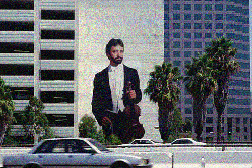

## Learning Image Restoration

Noisy image | Restored image
:--:|:--:
 | 

Pytorch unofficial implementation of *[On learning optimized reaction diffusion processes for effective image restoration](https://arxiv.org/abs/1503.05768)* by Yunjin Chen, Wei Yu and Thomas Pock.

---

You can train your own model :
```bash
python train.py models/new_model.pt
```

Or test an already trained one :
```bash
python test.py models/joint7.pt
```

### Experiments

I used the [BSDS300](https://www2.eecs.berkeley.edu/Research/Projects/CS/vision/grouping/segbench/) image dataset with additive gaussian noise like the authors.

2 *trained reaction diffusion* (TRD) models were considered like in the paper :
- TRD with 8 stages, 24 filters of size 5x5 (stored in `models/joint5.pt`)
- TRD with 8 stages, 48 filters of size 7x7 (stored in `models/joint7.pt`)

An Adam optimizer was used instead of the L-BFGS algorithm. During training, 180x180 patches randomly cropped from training images are fed to the network (GPU memory limitations might force you to reduce the size).

The learning phase uses backpropagation from Pytorch on the GPU whereas authors' MATLAB implementation used explicit derivatives on a CPU.

TRD models were first trained greedily as explained in the paper (see `models/greedyx.pt`). Then, they were finetuned using the joint method (see `models/jointx.pt`).

Here are the results of the experiment on the test set :

| PSNR (dB) |                  |                  |                  |                  |
|-----------|:----------------:|:----------------:|:----------------:|:----------------:|
|           |       σ=15       |                  |       σ=25       |                  |
| **Stage**     | `models/joint5.pt` | `models/joint7.pt` | `models/joint5.pt` | `models/joint7.pt` |
| 2         |       29.34      |       27.49      |       26.04      |       24.92      |
| 5         |       30.44      |       29.90      |       27.86      |       27.65      |
| 8         |       31.00      |       31.23      |       **30.13**      |       **30.26**      |

The results are better for σ=25 than the paper. Models were  trained only for 2-3 hours whereas the authors spent almost 24h on one model. Results can be improved easily with more time.
